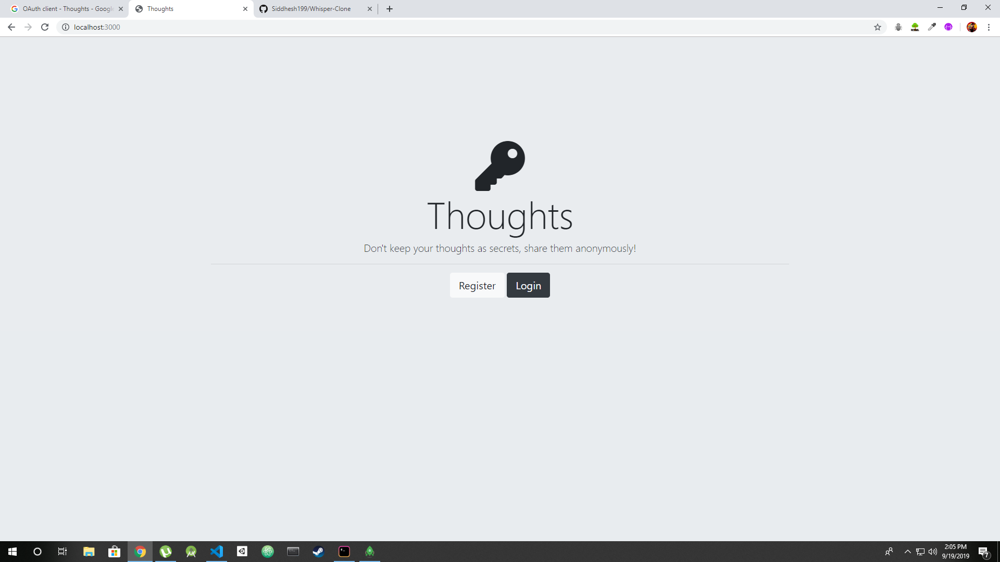

# Whisper-Clone

This is an application where users can share their thoughts anonymously. This is a node.js application with mongoDB as its database. The users can register/login locally via the passport-local-mongoose package or can sign in with google via passport-google-oauth20 package. The user session is maintained with cookies via the express-session package

# Screenshots

## Home Page

